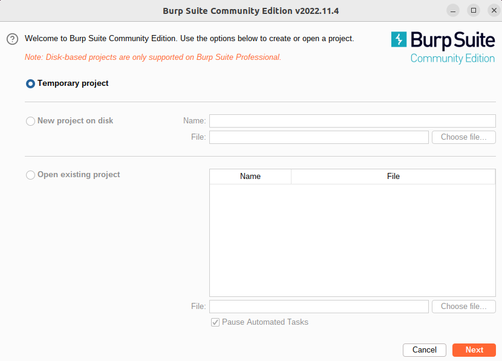
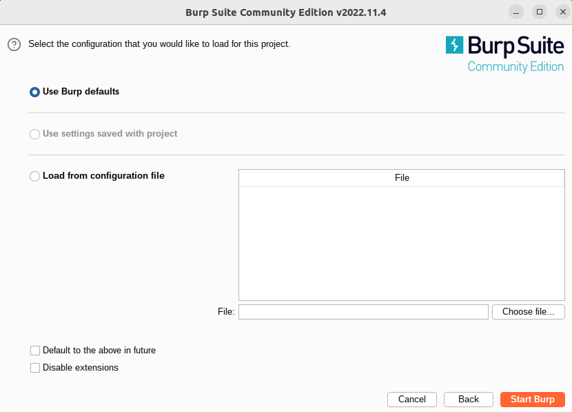
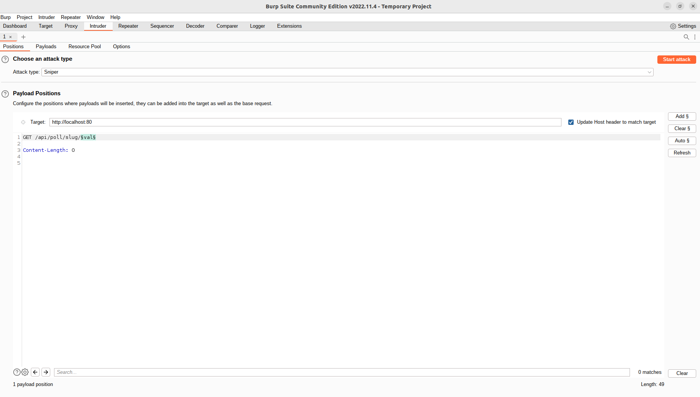
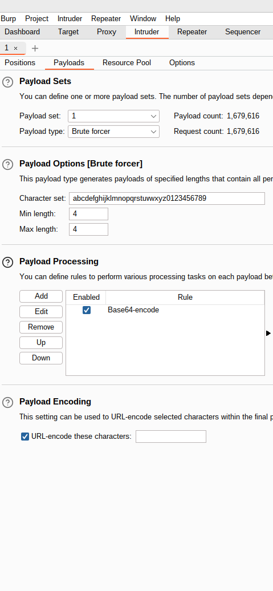

# Fuzzing
## Introduction
Fuzzing is a way of testing applications by providing random data as input trying to trigger errors such as exceptions, memory leak, stack smashing, double free or even higer level flaws such as sql injection.

Fuzzing can be applied to various type of systems : API, binaries, web apps..

Fuzzing is primarily used in two fields : V&V and Security  
Depending on the objectives the data generation techniques vary :  
- Grammar
- Dictionnary
- random mutators

## Fuzzing Doodle

Doodle is an application with multiple surface attack.  
We could choose to fuzz :
- The API
- The back-end binaries

## Fuzz the API

### Using Burp Suite  
Burp Suite is a paid software with a free limited version. Its purpose is to do penetration testing of web application. The intruder feature enables us to fuzz our Doodle API.

After downloading Burp, you can open it and create a new project or a temporary project :  
  
  
  
Choose default settings :  
  
  
  
Go to the "Intruder" tab and set up the HTTP request and choose what variable you will fuzz :  
  
  
  
Then in the Payload tab choose how to generate data :  
  
  
  
You can now launch the "attack" and check the server response.
You can use this tool to either check if your API works as intended, or, to try find bugs.  

### Using a custom script (Python)  
If no off the shelf software meet your needs, you can easily build custom script to fuzz your API  
```python
import requests
import random
import string

NUMBER_OF_TRY = 100

def get_random_string(length):
    # choose from all lowercase letter
    letters = string.hexdigits
    result_str = ''.join(random.choice(letters) for i in range(length))
    return result_str

# Define the URL of the API you want to fuzz
api_url = "http://localhost:4200/api/pool/slug/"


# Define a list of input values to use for fuzzing the API
fuzz_values = [get_random_string(24) for i in range(NUMBER_OF_TRY)]


# Iterate over the list of fuzz values and make a request to the API for each value
for val in fuzz_values:
    # Make a GET request to the API using the current fuzz value as a query parameter
    response = requests.get(api_url, params={"fuzz_param": val})

    # Print the status code of the response
    print(f"Response for fuzz value {val}: {response.status_code}")
```  
  
this script is calling the API trying to find hidden pool.
