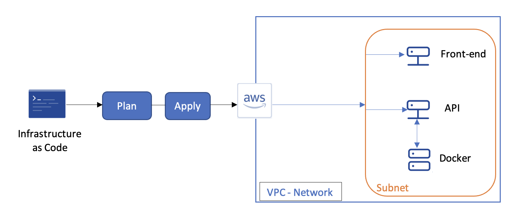
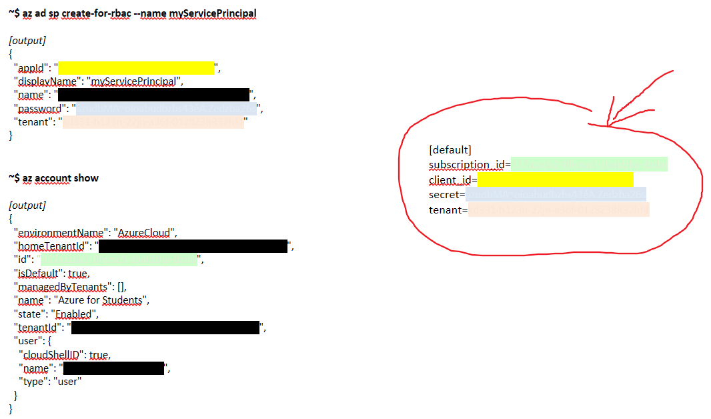

# Configuration Management Tools and Infrastructure as Code

The goal of this tutorial is to deploy an infrastructure using code (**IaC**).

IaC for Infrastructure as Code, is a type of IT configuration that allows to automatically manage and provision IT infrastructure through code without going through manual processes [1].

To do this, we have a multitude of tools supporting IaC. These can be grouped into two categories according to the languages they support: Declarative Language (Only specify what to do) and Procedural Language (Specify in detail how to do the task).

Thus, we have choosen two tools based on categories presented : 
- [**Ansible**](https://docs.ansible.com/ansible/latest/index.html), based on Declarative language and 
- [**Terraform**](https://www.terraform.io/docs/index.html), based on Procedural Language.

For this tutorial needs, we will use an existing application project named [**DOODLE**](https://github.com/selabs-ur1/doodle). 

### Description
The **doodle** app is made up by :
- a **back** which is developed using the [quarkus.io](https://quarkus.io/) framework
- a **front** which is developed in [angular](https://angular.io/) using the [primeng](https://www.primefaces.org/primeng/)  angular UI component library and the [fullcalendar](https://fullcalendar.io/) graphical component

## I-Terraform:

Terraform is a tool for building infrastructures from code. This tool allows us to manage an infrastructure thanks to configuration files. With this tool we can manage our infrastructures at the level of several providers such as **aws**, **azure**,... For this tutorial, we decided to deploy our infrastructures on **aws** using the project **doodle**. 

### Requirements: 
To follow this tutorial, you will need :
- [Terraform CLI](https://learn.hashicorp.com/tutorials/terraform/install-cli?in=terraform/aws-get-started) installed.
- [AWS-CLI](https://docs.aws.amazon.com/cli/latest/userguide/install-cliv2.html) installed.
- Have a [AWS compte](https://aws.amazon.com/free/).
- Your [AWS credentials](https://console.aws.amazon.com/iam/home?#/security_credentials). You can create your Access Key by going to the Access Keys tab (Access Key ID and Secret Access Key). Remember to keep it somewhere safe.

If you have all this installed you can configure your **aws** environment by running the following command. Follow the prompts to input your **aws** Access Key ID and Secret Access Key:
```
aws configure
```
### Infrastruture
Below you can see the infrastructure that will be deployed for this Terraform tutorial.



The infrastructure will be deployed in a Virtual Private Cloud (VPC). This allows resources to be launched in an isolated network. We could use the one provided by default, however this tutorial is also an opportunity to deepen our understanding of **aws** and to get more flexibility and control in our infrastructure.
In the following we will explain the important notions of a VPC.

**Subnetworks:** range of IP addresses in a VPC. The CIDR (Classless Inter-Domain Routing) address block is a subset of the VPC's CIDR block. Each subnet must reside entirely within one availability zone and cannot span multiple zones.

**NAT Gateway:** a network address translation gateway to allow instances in a private subnet to connect to the Internet while preventing the initiation of incoming connections from the Internet.

**NAT instance:** EC2 instance with the same purpose as NAT gateways. Unlike NAT gateways, they do not support IPV6 traffic and are unmanaged, which requires more configuration and maintenance. It is now recommended to use NAT gateways.

**Internet Gateway:** component that allows communication between instances and the Internet. 
 
### Input/Output
#### Input variables
The use of variables makes the code flexible and reusable. To define variables, create a ``variables.tf`` file.
The syntax for defining a variable is as follows:
```terraform
variable "varialbe_name" {
  description = "A description of the variable"
  type        = string
  default     = "default value"
}
```
To use it, just put ``var.variable_name`` in the place you want. The ``description`` and ``default`` fields are not mandatory. If the ``default`` field is not specified, you will be **prompted** for the value when the infrastructure is created.

#### Output query
This is how you can use output values to organize data to be easily queried and displayed to the Terraform user.
Create a file called ``outputs.tf`` in your directory.
Add the configuration below to ``outputs.tf`` to define outputs for your EC2 instance's ID and IP address.
```terraform
output "output_name" {
  description = "a description"
  value       = aws_instance.app_server.id 
}

output "other_outpuname" {
  description = "a description"
  value       = aws_instance.app_server.public_ip
}
```
>For creating **useful configurations**, it is important to use variables instead of **hard-coded values** to make your configuration more dynamic and flexible.

### Network configuration
In this part, we configure the network on which we will deploy the architecture seen previously. 
In a main.tf file, we start by defining the provider that we will use to set up our infrastructure. For this part of the tutorial we have chosen to use **aws**.

```terraform
terraform {
  required_providers {
    aws = {
      source  = "hashicorp/aws"
      version = "~> 3.0"
    }
  }
}
```
Still in the ``main.tf`` file, we configure the different parameters related to the provider. 
Two files are used to manage all the variables of our program. A file variables.tf is used to define the type of variables and possibly define a default value and a file ``terraform.tfvars`` which is used to define the real values of the variables. In fact, the purpose of this separation between definitions and values is to allow the definition of a common infrastructure design and then to apply specific values per environment.
In ``main.tf``, we add the code below:

```terraform
provider "aws" {
  region                  = var.region
  shared_credentials_file = var.creds
  profile                 = "default"
}
```
The credentials are used to communicate with **aws**.
In ``variable.tf`` we add these parameters:

```terraform
variable "region" {
  default = "eu-west-3"
}
variable "instance_type" {}
variable "creds" {}
```
In ``terraform.tfvars``:
```terraform
region             = "eu-west-3"
creds              = "~/.aws/credentials"
```
Let's go back to the ``main.tf`` file to define the network of our infrastructure.
In the same way, the value of the IP address of the network is given in the file ``terraform.tfvars``.
In ``main.tf`` we add the code below:

```terraform
# Create a VPC
resource "aws_vpc" "app_vpc" {
  cidr_block = var.vpc_cidr

  tags = {
    Name = "app-vpc"
  }
}
```
We add the following code in ``variables.tf``:
```terraform
variable "vpc_cidr" {}
```
We add the following code in ``terraform.tfvars``:
```terraform
vpc_cidr           = "178.0.0.0/16"
```
To ensure the communication we have just created with the outside world, we define a gateway in the main.tf file.

```terraform
resource "aws_internet_gateway" "igw" {
  vpc_id = aws_vpc.app_vpc.id

  tags = {
    Name = "vpc_igw"
  }
}
```
It is also possible to define a sub-network on which we will create our machines.
This is a good practice from an organizational point of view. In the main.tf file we add this piece of code.

```terraform
resource "aws_subnet" "public_subnet" {
  vpc_id                  = aws_vpc.app_vpc.id
  cidr_block              = var.public_subnet_cidr
  map_public_ip_on_launch = true
  availability_zone       = "eu-west-3a"

  tags = {
    Name = "public-subnet"
  }
}
```
In ``variables.tf``:
```terraform
variable "public_subnet_cidr" {}
```
In ``terraform.tfvars``:

```terraform
public_subnet_cidr = "178.0.10.0/24"
```
To manage the traffic coming from the Internet, we set up a routing table and we define the gateway created previously as the gateway responsible for this exchange.

```terraform
resource "aws_route_table" "public_rt" {
  vpc_id = aws_vpc.app_vpc.id

  route {
    cidr_block = "0.0.0.0/0"
    gateway_id = aws_internet_gateway.igw.id
  }

  tags = {
    Name = "public_rt"
  }
}
```
Finally, as private addresses are used, an association table is needed to define the corresponding public addresses.
```terraform
resource "aws_route_table_association" "public_rt_asso" {
  subnet_id      = aws_subnet.public_subnet.id
  route_table_id = aws_route_table.public_rt.id
}
```
### Instances creation
Let's now see how to deploy a computing instance (virtual machine).
To create an instance in Terraform, we need to initialize the following attributes:
``AMI`` this is the acronym for Amazon Machine Image (AMI) , so this is the image that will be run on our instance.
instance_type and key_name, the name and type of the instance that is successively initialized in the variables.tf and terraform.tfvars files. Among the machine types provided by **aws** we have chosen to work with a T2 instance ``instance_type = "t2.micro" ``. The attributes ``subnet_id`` and ``private_ip`` which are successively the network and the private address of the machine in question.
Then we have to define the security rules and the communication ports of the created machine. This is done in a file sg.tf. In this file, we define a resource for each instance and manage its different ports, the name of this resource is then assigned to the attribute ``security_groups`` in the ``main.tf`` file.
And finally, ``user_data``, the attribute in which we will define all the commands to be executed when the machine is created. This is done through a Bash script.

#### Front-end

We start by creating the first machine of our infrastructure, the ``web`` instance which is the front-end machine of the application.
We start by initializing the attributes mentioned above in the ``main.tft`` file:

```terraform
resource "aws_instance" "web" {
  ami             = "ami-06d79c60d7454e2af"
  instance_type   = var.instance_type
  key_name        = var.instance_key
  subnet_id       = aws_subnet.public_subnet.id
  private_ip      = "178.0.10.230"
  security_groups = [aws_security_group.sg.id]
  user_data = <<-EOF
  <here the script that have to be executed on the instance>
  EOF

  tags = {
     Name = "web_instance"
   }

   volume_tags = {
     Name = "web_instance"
   }
 }
```
##### Web server’s script 
For the web instance of our **doodle** application, we had to install an apache server. Here is the code in the ``main.tf`` file:
```terraform
  user_data = <<-EOF
  #!/bin/bash
  echo "*** Installing apache2"
  sudo apt update -y
  sudo apt install apache2 -y
  sudo curl -L -O https://github.com/sazagui/doodle/archive/refs/heads/master.zip
  sudo apt install nodejs -y
  sudo apt install npm -y
  sudo apt install unzip -y
  sudo unzip master.zip
  cd ./doodle-master/front/
  sudo npm install -y
  sudo npm run build
  sudo cp -r /doodle-master/front/dist/tlcfront/* /var/www/html/
  echo "*** Completed Installing apache2"
  EOF
  
}
```
##### Security rules

Next, we need to define the security rules and communication ports for the web machine. For this instance, we allow the SSH port and the 8080 port for the ```web``` server. 
Below is the code for the sg resource in the ``sg.tf`` file:

```terraform
resource "aws_security_group" "sg" {
  name        = "allow_ssh_http"
  description = "Allow ssh http inbound traffic"
  vpc_id      = aws_vpc.app_vpc.id

  ingress {
    description      = "SSH from VPC"
    from_port        = 22
    to_port          = 22
    protocol         = "tcp"
    cidr_blocks      = ["0.0.0.0/0"]
    ipv6_cidr_blocks = ["::/0"]
  }

  ingress {
    description      = "HTTP from VPC"
    from_port        = 80
    to_port          = 80
    protocol         = "tcp"
    cidr_blocks      = ["0.0.0.0/0"]
    ipv6_cidr_blocks = ["::/0"]
  }

  egress {
    from_port        = 0
    to_port          = 0
    protocol         = "-1"
    cidr_blocks      = ["0.0.0.0/0"]
    ipv6_cidr_blocks = ["::/0"]
  }

  tags = {
    Name = "allow_ssh_http"
  }
}
```


#### Back-end
In this part we will create the instances that will manage the back-end of the architecture. Due to the fact that a single instance cannot support the deployment of the container (docker) and at the same time the API (1Go RAM, 8 Go Storage), we decided to split the back-end into two parts (docker and API) and each part will be executed on its own instance. 

#### Docker
The purpose of this instance is to host the docker container in order to run the different API services. The API instance will then be able to communicate with it to access the etherpad, mail and mysql services. To define the instance, we do the following configuration:
```terraform
  resource "aws_instance" "docker" {
  ami             = "ami-06d79c60d7454e2af"
  instance_type   = var.instance_type
  key_name        = var.instance_key
  subnet_id       = aws_subnet.public_subnet.id
  security_groups = [aws_security_group.sg_docker.id]
  private_ip      = "178.0.10.240"
  user_data = <<-EOF
  <here the script that have to be executed on the instance docker>
  EOF

  tags = {
    Name = "docker_instance"
  }

  volume_tags = {
    Name = "docker_instance"
  }  
  
```

#### Docker’ script
Thus, the code for creating the tools to be deployed on the the docker instance is the following: 
	
```terraform
user_data = <<-EOF
   #!/bin/bash
  sudo su -
  whoami > utilisateur.txt
  apt update
  apt install unzip -y
  curl -L -O https://github.com/sazagui/doodle/archive/refs/heads/master.zip
  unzip master.zip
  rm -rf master.zip
  rm -rf doodle-master/front/
  cd ./doodle-master/api/
  sed -i 's/3.8/2.1/g' docker-compose.yaml
  apt install docker.io -y
  service docker start
  apt install docker-compose -y
  usermod -a -G docker ec2-user
  systemctl enable docker
  docker-compose up --detach > compose.txt
EOF
```

##### Security rules
For security reasons, each instance must have a number of rules to block or allow connections. For this docker instance, we have decided to block all ports except those through which the API accesses the various services. In input we open port 22 for easy access to our remote instance, port 2525 to allow the back-end access to the mail service, port 3306 for access to the mysql database, port 9001 for access to the etherpad service. In output we block all ports. 
The code below describes how these security rules are defined.
```terraform

resource "aws_security_group" "sg_docker" {
  name        = "allow_docker"
  description = "Allow docker inbound traffic"
  vpc_id      = aws_vpc.app_vpc.id

  ingress {
    description      = "SSH from VPC"
    from_port        = 22
    to_port          = 22
    protocol         = "tcp"
    cidr_blocks      = ["0.0.0.0/0"]
    ipv6_cidr_blocks = ["::/0"]
  }

  ingress {
    cidr_blocks = ["0.0.0.0/0"]
    from_port   = 8
    to_port     = 0
    protocol    = "icmp"
    description = "Allow ping"
  }

  ingress {
    description      = "Mailer from VPC"
    from_port        = 2525
    to_port          = 2525
    protocol         = "tcp"
    cidr_blocks      = ["0.0.0.0/0"]
    ipv6_cidr_blocks = ["::/0"]
  }

  ingress {
    description      = "MySql from VPC"
    from_port        = 3306
    to_port          = 3306
    protocol         = "tcp"
    cidr_blocks      = ["0.0.0.0/0"]
    ipv6_cidr_blocks = ["::/0"]
  }

  ingress {
    description      = "Etherpad from VPC"
    from_port        = 9001
    to_port          = 9001
    protocol         = "tcp"
    cidr_blocks      = ["0.0.0.0/0"]
    ipv6_cidr_blocks = ["::/0"]
  }

  egress {
    from_port        = 0
    to_port          = 0
    protocol         = "-1"
    cidr_blocks      = ["0.0.0.0/0"]
    ipv6_cidr_blocks = ["::/0"]
  }


  tags = {
    Name = "allow_docker_port"
  }
}
```
#### API
As for the instance of the API, it will allow the execution of the back-end of the **doodle** application and the processing of requests from the front-end. In input we open port 22 to access our remote instance, port 8080 to allow the front-end access to the back-end.  As for the docker instance, we do the following configuration:
```terraform
  resource "aws_instance" "backend" {
  ami             = "ami-06d79c60d7454e2af"
  instance_type   = var.instance_type
  key_name        = var.instance_key
  subnet_id       = aws_subnet.public_subnet.id
  security_groups = [aws_security_group.sg_backend.id]
  private_ip      = "178.0.10.250"
  user_data = <<-EOF
  <here the script that have to be executed on the instance>
  EOF
  tags = {
      Name = "backend_instance"
  }

  volume_tags = {
     Name = "backend_instance"
   }
 }

```
##### API script
As for the code creating the tools to be deployed on the API, we get the following script: 

```terraform
user_data = <<-EOF
  #!/bin/bash
  sudo su -
  whoami > utilisateur.txt
  apt update
  apt install unzip -y
  apt install maven -y
  apt install openjdk-11-jdk -y
  export JAVA_HOME=/usr/lib/jvm/java-11-openjdk-amd64
  export PATH=$PATH:$JAVA_HOME/bin
  curl -L -O https://github.com/sazagui/doodle/archive/refs/heads/master.zip
  unzip master.zip
  rm -rf master.zip
  rm -rf doodle-master/front/
  cd ./doodle-master/api/
  sed -i '' 's/localhost/178.0.10.240/g' src/main/resources/application.yml
  ./mvnw install -DskipTests  > package1.txt
EOF
```
##### Security rule
As with the docker instance, the API also has security rules allowing communication with the docker and the front end while blocking other ports. These security rules are defined as follows:

```terraform
resource "aws_security_group" "sg_docker" {
  name        = "allow_docker"
  description = "Allow docker inbound traffic"
  vpc_id      = aws_vpc.app_vpc.id

  ingress {
    description      = "SSH from VPC"
    from_port        = 22
    to_port          = 22
    protocol         = "tcp"
    cidr_blocks      = ["0.0.0.0/0"]
    ipv6_cidr_blocks = ["::/0"]
  }

  ingress {
    cidr_blocks = ["0.0.0.0/0"]
    from_port   = 8
    to_port     = 0
    protocol    = "icmp"
    description = "Allow ping"
  }

  ingress {
    description      = "Mailer from VPC"
    from_port        = 2525
    to_port          = 2525
    protocol         = "tcp"
    cidr_blocks      = ["0.0.0.0/0"]
    ipv6_cidr_blocks = ["::/0"]
  }

  ingress {
    description      = "MySql from VPC"
    from_port        = 3306
    to_port          = 3306
    protocol         = "tcp"
    cidr_blocks      = ["0.0.0.0/0"]
    ipv6_cidr_blocks = ["::/0"]
  }

  ingress {
    description      = "Etherpad from VPC"
    from_port        = 9001
    to_port          = 9001
    protocol         = "tcp"
    cidr_blocks      = ["0.0.0.0/0"]
    ipv6_cidr_blocks = ["::/0"]
  }

  egress {
    from_port        = 0
    to_port          = 0
    protocol         = "-1"
    cidr_blocks      = ["0.0.0.0/0"]
    ipv6_cidr_blocks = ["::/0"]
  }

  tags = {
    Name = "allow_docker_port"
  }
}
```


For this terraform tutorial, we defined our infrastructure, from network to instance, using variables. As you will notice, a mix of variable type and hard-coded value is done for learning purposes.
You can find the complete code of the files via the following links:
[main.tf](terraform/main.tf),
[variables.tf](terraform/variables.tf),
[terraform.tfvars](terraform/terraform.tfvars),
[output.tf](terraform/output.tf) and
[sg.tf](terraform/sg.tf)

For running the code, execute the command below: 
``terraform init``
``terraform apply``


## II- Ansible
*Useful resources for Ansible overview:*
- [Introduction](https://www.youtube.com/watch?v=Cisg9bLhLkk&t=1s&ab_channel=xavki)
- [Notion_and_definitions](https://www.youtube.com/watch?v=tirjpYSMkkM&ab_channel=xavki)


### Requirements
To realize this tutorial, you must have :
- a professional email address (from your school) to create a free account to use some cloud providers services. **No needs of Credit card**


Our Infrastructure will be composed of two machines myVM4DoodleFrontEnd for the front and myVM4DoodleBackEnd for the back. The work area on this app will be limited on the front end part. We will only deploy a machine, by the means of IaC tools, which will support the front end of the app. This front vm, to launch properly the front component of the **doodle** app will needs : 
- a Web Server app; we chose Apache
- to allow connection from internet on 80 port (http ones) 
- to have in a specific path (the webserver one) the front end **doodle** app code compiled

To deploy the infrastructure needed to launch the front end part of **doodle** app, will have chosen to use the cloud provider [**Azure** from Microsoft](https://azure.microsoft.com/fr-fr/free/search/?OCID=AID2200187_SEM_48fa2f35e22c1b66c2984e9a8add5db6:G:s&ef_id=48fa2f35e22c1b66c2984e9a8add5db6:G:s&msclkid=48fa2f35e22c1b66c2984e9a8add5db6). 

**Step 1: Create your free **Azure** account**

Follow the **start free** instructions from [**Azure** student page](https://azure.microsoft.com/en-us/free/students/) to create your **Azure** account.
As a reminder, normally no need to fill any credit card section if you selected the creation of a student account which is totally free.
Once the account is created, move to ``Step 2``.

**Step 2: Create a Principal of service**

On **Azure**, a Principal of service provides you with a dedicated account to manage **Azure** resources with Ansible.
Launch ****Azure** Cloud Shell** on Bash environnement, then accept the **creation of storage** on your **Azure** student account.
Once the terminal prompt is available, run the command ``az ad sp create-for-rbac --name myServicePrincipal`` to create a principal of service.
Keep the output of the command, particularly values of `appID`, `password` and `tenant`.
Then, run `az account show` to get details on your subscription. As the last one, keep the output information, especially `id`.

In fact, to authenticate to **Azure** with the service principal, you need the following:
- SubscriptionID from your account
- ApplicationId fron Principal of service
- Password of the Principal of service
- Tenant of the Principal of Service

Now, construct the pattern of the credential file to connect to your **Azure** principal of service
<p style='text-align: center'>
    
</p>

Keep it somewhere, we will use it later.

**Step 3: Create the first machine which will be the Ansible Management principal node**

On ****Azure** Cloud Shell** on Bash/Powershell environnement, you have already access **ansible**. Run `ansible --version` to verify it.
Create an ansible playbook named `vm1_playbook.yml` in which we will design how to create the main machine whose role will be the Ansible Server.
- Content of `vm1_playbook.yml`
```shell script
- name: Create Azure VM which role will be the Ansible Server
  hosts: localhost
  connection: local
  vars_prompt:
    - name: password
      prompt: "Enter the new VM local administrator password"
  tasks:
  - name: Create resource group
    azure_rm_resourcegroup:
      name: tutoDLCAnsible-rg
      location: eastus
  - name: Create virtual network
    azure_rm_virtualnetwork:
      resource_group: tutoDLCAnsible-rg
      name: myVnet
      address_prefixes: "178.0.0.0/16"
  - name: Add subnet
    azure_rm_subnet:
      resource_group: tutoDLCAnsible-rg
      name: mySubnet
      address_prefix: "178.0.10.0/24"
      virtual_network: myVnet
  - name: Create public IP address
    azure_rm_publicipaddress:
      resource_group: tutoDLCAnsible-rg
      allocation_method: Static
      name: myPublicIP
    register: output_ip_address
  - name: Public IP of VM
    debug:
      msg: "The public IP is {{ output_ip_address.state.ip_address }}."
  - name: Create Network Security Group that allows ONLY SSH
    azure_rm_securitygroup:
      resource_group: tutoDLCAnsible-rg
      name: myNetworkSecurityGroup
      rules:
        - name: SSH
          protocol: Tcp
          destination_port_range: 22
          access: Allow
          priority: 1001
          direction: Inbound
  - name: Create Network Security Group to allow **Doodle** app works
    azure_rm_securitygroup:
      resource_group: tutoDLCAnsible-rg
      name: myNetworkSecurityGroup1
      rules:
        - name: SSH
          protocol: Tcp
          destination_port_range: 22
          access: Allow
          priority: 1001
          direction: Inbound
        - name: port_80
          protocol: Tcp
          destination_port_range: 80
          access: Allow
          priority: 1002
          direction: Inbound
  - name: Create virtual network interface card
    azure_rm_networkinterface:
      resource_group: tutoDLCAnsible-rg
      name: myNIC
      virtual_network: myVnet
      subnet: mySubnet
      public_ip_name: myPublicIP
      security_group: myNetworkSecurityGroup
      private_ip_allocation_method: Static
      private_ip_address: 178.0.10.210
  - name: Create VM
    azure_rm_virtualmachine:
      resource_group: tutoDLCAnsible-rg
      name: myVM4AnsibleServer
      vm_size: Standard_DS1_v2
      admin_username: azureuser
      admin_password: "{{ password }}"
      network_interfaces: myNIC
      image:
        offer: CentOS
        publisher: OpenLogic
        sku: '7.5'
        version: latest
```

As explanation:
1. The task named `Create resource group` will create a group of resources to which the `myVM4AnsibleServer` will be part of. In **Azure**, the concept of **resource group** is a container that holds related resources (Virtual machines, storage accounts, web apps, databases, and virtual networks...); even Resource groups, subscriptions, management groups, and tags are also examples of resources. A good practice in **Azure** is to affect resource groups resources to manage them well. [useful_link](https://docs.microsoft.com/en-us/azure/azure-resource-manager/management/overview#resource-groups). This resource will be called **tutoDLCAnsible-rg**
2. The tasks named `Create virtual network`, `Add subnet`, `Create public IP address` will respectively create virtual network, a subnetwork and a public IP address which will be affected to the resource **tutoDLCAnsible-rg** and will be used by a network interface.
3. The tasks named `Create Network Security Group that allows ONLY SSH` and `Create Network Security Group to allow Doodle app works` will create Network rules respectively for **vm1** and then for the **frontend-vm**. You will notice that the **frontend-vm**  must have the port 80 open and reachable from internet to access easily to the front off the **doodle** app.
4. The task named `Create virtual network interface card` will setup the network interface with the previous virtual network, subnet, Public IP address, network rules and fix a static IP private.
5. The last task `Create VM` will create finally create the desired machine.


Run `ansible-playbook vm1_playbook.yml` to execute the playbook. *Reminder*: you will have to enter the password for the **myVM4AnsibleServer**'s user.
Note the Public IP adress of your new vm `myVM4AnsibleServer` created.

Verify if the vm is launched. For that go in `group resource`, then in `tutoDLCAnsible-rg` and select `myVM4AnsibleServer`; you will get detail on the state of the vm.


**Step 4: Connection to the virtual machine created using ssh**
Using the SSH command, connect to the public IP address of your virtual machine.
`ssh azureuser@<vm_public_ip_address>` and replace <vm_public_ip_address> with the appropriate value returned in the previous commands.


**Step 5: Install Ansible on the virtual machine created**
After the connection established, run the following command on your CentOS Machine `myVM4AnsibleServer` created :

*//Update all packages that have available updates.*
`sudo yum update -y`

*//Install Python 3 and pip.*
`sudo yum install -y python3-pip`

*//Upgrade pip3.*
`sudo pip3 install --upgrade pip`

*//Install Ansible.*
`pip3 install "ansible==2.9.17"`

*//Install Ansible Azure_rm module for interacting with Azure.*
`pip3 install ansible[azure]`

*//Test Ansible*
`ansible --version`


**Step 6: Connect your `myVM4AnsibleServer` to your azure account**

Still connected to `myVM4AnsibleServer` via ssh, create and open a file named `credentials`
```shell script
mkdir ~/.azure
nano ~/.azure/credentials
```
The content following the pattern kept in the **step 2** section, paste it in the `credentials` file created. Save and close it.


**Step7: Create the `myVM4DoodleFrontEnd` machine for the front end using Iac process of Ansible**

Following likely the same process as the one in **step 3**, create a playbook named `frontEndVm_playbook.yml` on the `myVM4AnsibleServer`, which content is :
```shell script
- name: Create Azure VM which role will be the Front End of Doodle App
  hosts: localhost
  connection: local
  vars_prompt:
    - name: password
      prompt: "Enter local administrator password"
  tasks:
  - name: Create public IP address
    azure_rm_publicipaddress:
      resource_group: tutoDLCAnsible-rg
      allocation_method: Static
      name: myPublicIP1
    register: output_ip_address
  - name: Public IP of VM
    debug:
      msg: "The public IP is {{ output_ip_address.state.ip_address }}."
  - name: Create virtual network interface card
    azure_rm_networkinterface:
      resource_group: tutoDLCAnsible-rg
      name: myNIC1
      virtual_network: myVnet
      subnet: mySubnet
      public_ip_name: myPublicIP1
      security_group: myNetworkSecurityGroup1
      private_ip_allocation_method: Static
      private_ip_address: 178.0.10.230
  - name: Create VM
    azure_rm_virtualmachine:
      resource_group: tutoDLCAnsible-rg
      name: myVM4DoodleFrontEnd
      vm_size: Standard_DS1_v2
      admin_username: azureuser1
      admin_password: "{{ password }}"
      network_interfaces: myNIC1
      image:
        offer: CentOS
        publisher: OpenLogic
        sku: '7.5'
        version: latest
```

Then run the command `ansible-playbook frontEndVm_playbook.yml`
Let notice that for this machine, the static private IP adress given is **178.0.10.230**

**Step 8: Create a Certificate to allow ssh connection from the `myVM4AnsibleServer` to the `myVM4DoodleFrontEnd`**

On the `myVM4AnsibleServer`, test the connection with `myVM4DoodleFrontEnd` running `ping 178.0.10.230`.
Then run the command `ssh-keygen -m PEM -t rsa -b 4096` to generate an authentication certificate. (Don't bother yourself to write a passphrase). Normally, the certificate has been generated in the default folder */home/azureuser/.ssh/id_rsa*. Now send the public key to the `myVM4DoodleFrontEnd` running `ssh-copy-id -i /home/azureuser/.ssh/id_rsa azureuser1@178.0.10.230`, enter the password chosen for the `myVM4DoodleFrontEnd` administrator user, and it will be ok. Then, create a file `hosts` which will note the different nodes, run `nano hosts`. Its content is : 
```shell script
# ~/ansible/hosts
[frontend_nodes]
azureuser1@178.0.10.230
```
To test if the certificate will be taken for following connection with the front machine run `ansible all -m ping -v -i ./hosts`


**Step 9: Complete the structure of our infrastructure by installing requirements to launch properly doodle front end**

On the `myVM4AnsibleServer`, write a new ansible playbook to install the web server apache2 and the compiled project of **doodle** front. Run `nano install_FE_requirement.yml`, fill it with :
```shell script
---
- name: This sets up requirements for Front End of Doodle App
  hosts: azureuser1@178.0.10.230
  become: yes
  tasks:
  - name: Install apache packages
    yum:
      name: httpd
      state: present
  - name: ensure httpd is running
    service:
      name: httpd
      state: started
  - name: Open port 80 for http access
    firewalld:
      service: http
      permanent: true
      state: enabled
  - name: Restart the firewalld service to load in the firewall changes
    service:
      name: firewalld
      state: restarted
  - name: Intall the Front End of **Doodle** project
    ansible.builtin.unarchive:
       src: https://github.com/ewiibo/DLC-doodleFE-compiled/archive/refs/heads/master.zip
       dest: /home/azureuser1/
       remote_src: yes
  - name: Copy the file in the apache server folder
    ansible.builtin.copy:
       src: /home/azureuser1/DLC-doodleFE-compiled-master/dist/tlcfront/
       dest: /var/www/html
       remote_src: yes
  - name: Restart the Apache serveur
    service:
       name: httpd
       state: restarted
```
Then run `ansible-playbook -i ./hosts ~/install_FE_requirement.yml -K`

**Step 10: Test your doodle app front end through internet**

Open on your computer an internet navigator, then launch the public IP address of your `myVM4DoodleFrontEnd`; it is supposed to give you the front of **doodle** project.


**Partial Conclusion**

As you saw through this tutorial, based on IaC and using appropriate tools, you can rapidly deploy an infrastructure for a specific needs. Normally, in your environnement, you will have a specific machine whose role will be the Ansible Management Nodes, connected to a cloud service, and with some playbook well designed, you will be able to deploy rapidly the infrastructure you want. Isn't it GREAT, Infrastructure As Code 😀.

### Liens utiles
- [1] https://www.lebigdata.fr/infrastructure-as-code-definition

## Comparison

In this tutorial, using the **aws** and **Azure** providers, we could discover the two tools Terraform and Ansible which allowed us to make a small comparison between both.
Each tool has its unique features and limitations.

**Terraform** has good scheduling capabilities and is very user-friendly. It integrates well with **Docker**, which handles configuration management a bit better than **Terraform**. But there is no clear evidence of how target devices are brought to their final state, and sometimes the final configuration is unnecessary.

**Ansible** has better security and ACL features. It is considered a mature tool because it easily adapts to traditional automation frameworks. It offers simple operations and helps to code quickly. But, on the other hand, it is not good for services like logical dependencies, orchestration services and interconnected applications.

When preparing this tutorial, the handling of **Terraform** was more fluid than the handling of **Ansible**.

## Conclusion


In this tutorial, we have seen the management of an infrastructure through a code through the use of **Terraform** and **Ansible**, from the creation of the instance to the deployment of the project. We have seen the advantages and disadvantages of each tool. In addition, other tools also exist such as puppet, saltstack, chef, etc.  
Infrastructure as Code (or IaC) is a key contributor to meeting the requirements of agile software development. Infrastructure management is performed using preconfigured scripts at an unbeatable speed compared to a manual management environment.  The solutions presented each have advantages and disadvantages.
It is therefore important to choose the tool that best meets our needs, even if it means combining several tools. 

