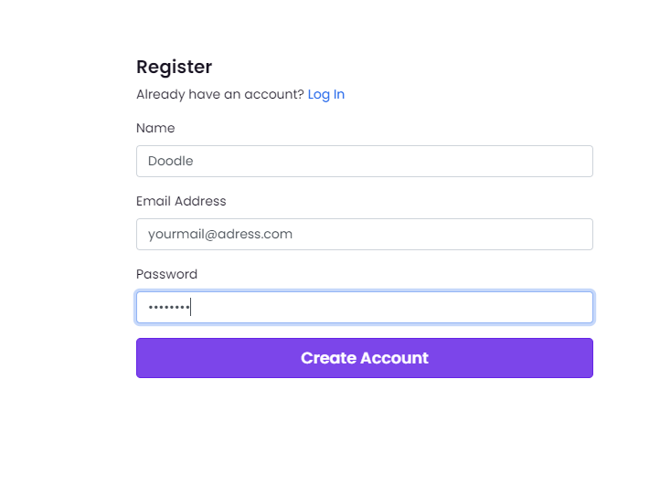

# A/B Testing 

## Introduction

The A/B testing goal is to determine which versions from two versions of a same aplication is the more appealing to the users.
For that we are going to show to each user one version selected 
L'A/B testing consistent à comparer deux versions d'une même application en faisant tester chaques versions à un grand nombre d'utiliseurs.
On le fait de manière totalement transparente, en envoyant les utilisateur vers l'une des deux versions de manière totalement arbitraire.
On va ensuite récolter les données correspondantes au(x) critère(s) que l'on cherche à améliorer, afin de pouvoir quelle version est la plus intéressante pour nous.

## Presentation of a road map to achieve it

### Step 0 : get Doodle from the current git provided
git clone https://github.com/selabs-ur1/doodle.git

### Step 1 : Download GrowthBook and start it
For this tutorial we will use GrowthBook, in a terminal run the follonwing instruction : 

```
git clone https://github.com/growthbook/growthbook.git
cd growthbook
docker-compose up -d
```

Then go to [http://localhost:3000](localhost:3000). 

You should arrive to this page : 

Click on Register and fill the box as the photo (no data will be save as long you stay on localhost)



Connect with the information you have provided

Go to the section Metrics click to "Add your first metric"

A metric will design on which way you will compare your version A and B


Set up your metric as you want. In this tuto we will use a Binomial metric and let the default value.


### Step 2 : Ajouter la librairie GrowthBook dans le code de base

For adding the library in js, type the following command 

```
https://docs.growthbook.io/lib/js
cd front
npm install --save @growthbook/growthbook
```

If you need more information refere to the [https://docs.growthbook.io/lib/js](documentation)


### étape 3 : Generate a modification


For this example will add a reset button which will clear all the selected choice on the calendar. 

Add the following code at the file front/src/app/create-poll-component/create-poll-compenent.component.html : 
```HTML
<div>
	<p-button label="Tout Supprimer"></p-button>
</div>
```
where you want to add this button. (We will not implemant all the interaction with this button as long we just need an easy example)

### étape 4 : faire tourner les différentes versions et sauvegardés les statistiques de chacunes

### étape 5 : Visualiser, et monitorer l'impact des variations à l'aide de GrowthBook

https://www.youtube.com/watch?v=NCIEe1me9oE


### Going deeper

If you are interresting with Grothwbook, 
Métrics calculée : nombre de cliques sur le bouton + temps passée sur la page comportant le bouton